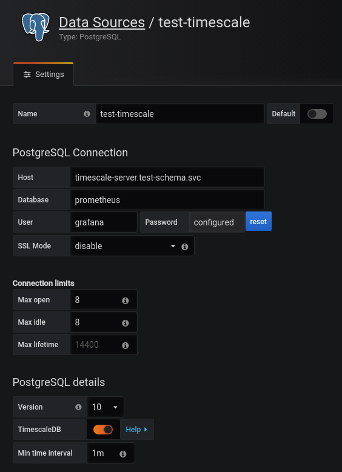

# Kubernetes Deploy

This guide describes how to set up a Timescale server with ephemeral storage (**data will be lost when it restarts**),
a pair of highly-available SQL adapters, and Grafana dashboards.

## Contents

- [Kubernetes Deploy](#kubernetes-deploy)
  - [Contents](#contents)
  - [Setup](#setup)
  - [Notes](#notes)
  - [Grafana](#grafana)
  - [Prometheus](#prometheus)
  - [Troubleshooting](#troubleshooting)
    - [Pods Not Running](#pods-not-running)
    - [Schema Not Created](#schema-not-created)
    - [Still Not Working](#still-not-working)

## Setup

To deploy TimescaleDB and this SQL adapter:

- create a namespace: `k create ns test-schema`
- apply node labels
  - for server nodes: `k label node/server timescale-role=server`
  - for adapter nodes: `k label node/adapter timescale-role=adapter`
- apply the server: `k apply -n test-schema -f kubernetes/server.yml`
- create an adapter role ([getting started](../README.md#getting-started)):
  - `k exec -n test-schema -it timescale-server-0 -- psql -U postgres`
  - `CREATE USER prometheus_adapter WITH LOGIN PASSWORD 'very-secret';`
  - exit the `k exec` shell
  - `k exec -n test-schema -it timescale-server-0 -- sh -c 'cd /app; PGUSER=postgres PGDATABASE=prometheus /app/scripts/schema-grant.sh prometheus_adapter adapter'`
- create a Grafana role:
  - `k exec -n test-schema -it timescale-server-0 -- psql -U postgres`
  - `CREATE USER prometheus_grafana WITH LOGIN PASSWORD 'very-secret';`
  - exit the `k exec` shell
  - `k exec -n test-schema -it timescale-server-0 -- sh -c 'cd /app; PGUSER=postgres PGDATABASE=prometheus /app/scripts/schema-grant.sh prometheus_grafana grafana'`
- create a secret with PG connection info:
  `k create secret generic timescale-adapter-env -n test-schema --from-literal=PGUSER=prometheus_adapter --from-literal=PGPASSWORD=very-secret --from-literal=PGDATABASE=prometheus`
- apply the adapter: `k apply -n test-schema -f kubernetes/adapter.yml`

The server and two adapter pods should be `Running`:

```shell
> kubectl -n test-schema get pods

NAME                                 READY   STATUS    RESTARTS   AGE
timescale-adapter-5dbfbd4586-hvgbz   1/1     Running   0          55s
timescale-adapter-5dbfbd4586-tm2rj   1/1     Running   0          32s
timescale-server-0                   1/1     Running   0          9m3s
```

If they are not, check [the troubleshooting section](#troubleshooting).

The server should have a `prometheus` database with the schema set up:

```shell
> kubectl -n test-schema exec -it timescale-server-0 -- psql -U postgres -d prometheus

prometheus=# \d
                       List of relations
 Schema |          Name          |       Type        |  Owner
--------+------------------------+-------------------+----------
 public | agg_container_cpu      | view              | postgres
 public | agg_container_mem      | view              | postgres
 public | agg_instance_load      | view              | postgres
 public | agg_instance_load_long | view              | postgres
 public | agg_instance_pods      | view              | postgres
 public | cat_container          | materialized view | postgres
 public | cat_instance           | materialized view | postgres
 public | cat_name               | materialized view | postgres
 public | metric_labels          | table             | postgres
 public | metric_samples         | table             | postgres
 public | metrics                | view              | postgres
(11 rows)
```

## Notes

- The server sets up the `prometheus` database and metrics schema within that when it starts up.
- The server pod does not have persistent storage, so any data will be lost when it restarts.
- The `--pg.conn-str` parameter will be printed in the logs, please put the password in the `PGPASSWORD` env var.

## Grafana

Create a data source:



Import the dashboards from [`grafana/`](./grafana/) or create your own using queries from
[`schema/alert/`](../schema/alert).

## Prometheus

Configure your Prometheus replicas:

```yaml
remoteWrite:
- queueConfig:
    capacity: 6400
    maxSamplesPerSend: 800
    maxShards: 8
    minShards: 4
  url: http://timescale-adapter.test-schema.svc/write
```

## Troubleshooting

### Pods Not Running

`k -n test-schema describe pod` should have more information. The adapter pods have anti-affinity and will not be placed on the same node. The labels currently prevent them from being placed with the server. Database info and errors will appear in the adapter pod's logs:

```shell
> kubectl -n test-schema logs timescale-adapter-579f68b6ff-g5k64
level=info ts=2019-11-28T19:34:12.447Z caller=main.go:109 msg="Allowed metric names" names=16
level=info ts=2019-11-28T19:34:12.447Z caller=main.go:169 msg="Starting postgres..." conn="postgres://timescale-server?sslmode=disable"
level=info ts=2019-11-28T19:34:12.447Z caller=client.go:143 storage=postgres msg="connecting to database" idle=8 open=8
level=info ts=2019-11-28T19:34:12.447Z caller=client.go:153 storage=postgres msg="creating cache" size=65535
level=info ts=2019-11-28T19:34:12.447Z caller=main.go:179 msg="Starting up..."
```

### Schema Not Created

`k -n test-schema logs timescale-server-0` should show the schema creation script, queries,
and any errors that may have occurred:

```shell
> kubectl -n test-schema logs timescale-server-0

...
CREATE VIEW
Creating catalog views...
SELECT 0
SELECT 0
SELECT 0
Creating a drop_chunks policy requires TimescaleDB cloud or enterprise.
You may need to set up a cronjob in Kubernetes or SystemD to prune old data.
Please refer to the docs for more info: https://docs.timescale.com/latest/using-timescaledb/data-retention

waiting for server to shut down....2019-12-21 22:21:51.150 UTC [31] LOG:  received fast shutdown request
2019-12-21 22:21:51.183 UTC [31] LOG:  aborting any active transactions
2019-12-21 22:21:51.183 UTC [60] LOG:  terminating TimescaleDB job scheduler due to administrator command
2019-12-21 22:21:51.183 UTC [56] FATAL:  terminating connection due to administrator command
2019-12-21 22:21:51.183 UTC [60] FATAL:  terminating connection due to administrator command
2019-12-21 22:21:51.183 UTC [45] LOG:  terminating TimescaleDB job scheduler due to administrator command
2019-12-21 22:21:51.184 UTC [45] FATAL:  terminating connection due to administrator command
2019-12-21 22:21:51.185 UTC [38] LOG:  terminating TimescaleDB background worker launcher due to administrator command
2019-12-21 22:21:51.185 UTC [38] FATAL:  terminating connection due to administrator command
2019-12-21 22:21:51.186 UTC [31] LOG:  worker process: logical replication launcher (PID 39) exited with exit code 1
2019-12-21 22:21:51.186 UTC [31] LOG:  worker process: TimescaleDB Background Worker Launcher (PID 38) exited with exit code 1
2019-12-21 22:21:51.186 UTC [31] LOG:  worker process: TimescaleDB Background Worker Scheduler (PID 60) exited with exit code 1
2019-12-21 22:21:51.187 UTC [31] LOG:  worker process: TimescaleDB Background Worker Scheduler (PID 45) exited with exit code 1
2019-12-21 22:21:51.187 UTC [33] LOG:  shutting down
.2019-12-21 22:21:52.389 UTC [31] LOG:  database system is shut down
 done
server stopped

PostgreSQL init process complete; ready for start up.

2019-12-21 22:21:52.600 UTC [1] LOG:  listening on IPv4 address "0.0.0.0", port 5432
2019-12-21 22:21:52.600 UTC [1] LOG:  listening on IPv6 address "::", port 5432
2019-12-21 22:21:52.662 UTC [1] LOG:  listening on Unix socket "/var/run/postgresql/.s.PGSQL.5432"
2019-12-21 22:21:52.801 UTC [121] LOG:  database system was shut down at 2019-12-21 22:21:52 UTC
2019-12-21 22:21:52.871 UTC [1] LOG:  database system is ready to accept connections
2019-12-21 22:21:52.874 UTC [127] LOG:  TimescaleDB background worker launcher connected to shared catalogs
```

### Still Not Working

Run the `schema-debug` script:

```shell
> ./scripts/schema-debug.sh | tee schema-debug.log

Prometheus SQL adapter - schema debug report
Sat Dec 21 17:22:36 CST 2019


 schema_version
----------------
 0.3.3
(1 row)

  table_name   | total_size
---------------+------------
 metric_labels |      57344
 __total       |     909312
(2 rows)

 table_name | compression_ratio
------------+-------------------
...
```

Then [create a Github issue](https://github.com/ssube/prometheus-sql-adapter/issues/new/choose) and attach the debug
log.
